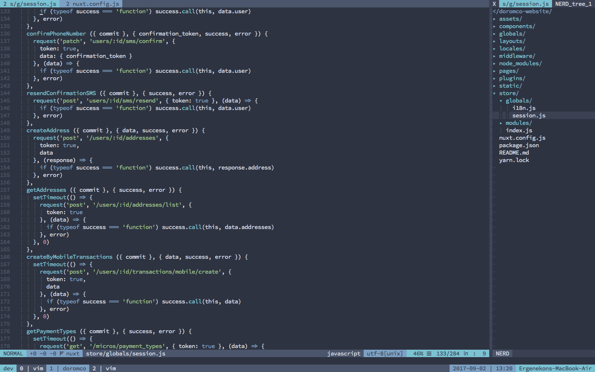

daft.vim
========
Fast and powerful vimrc.

## Pre-requisites

* To make all the plugins work, specifically [neocomplete](https://github.com/Shougo/neocomplete.vim), you need [vim with lua](https://github.com/Shougo/neocomplete.vim#requirements).

## Installation

After you backup your `~/.vimrc` file and `~/.vim/` folder (this is not important if you haven't used Vim before), you can install this by running this bash line, press enter if you see any error messages:

```bash
echo "runtime vimrc" > ~/.vimrc && mkdir ~/.vim && cd ~/.vim && git clone https://github.com/ergenekonyigit/daft.vim.git . && git clone https://github.com/junegunn/vim-plug.git ~/.vim/bundle/vim-plug && vim +PlugInstall
```

You're all set! Enjoy!

## Shortcuts

`<Leader>` is defined as the `\` key by default. `C-x` means Control + x.

* `<leader>t`: Tagbar toggle
* `<leader>w`: Fast saving
* `<leader>ev`: Quickly edit the vimrc file
* `<leader>ww`: Easy window swap
* `<leader>]`: Open/Close NERDTree
* `<leader>[`: Navigate between split wiew
* `<leader>n`: New empty tab
* `<leader>b`: Close tab
* `<leader>c`: Close windows
* `<leader>v`: Split window vertically
* `<leader>s`: Split window horizontally
* `<leader><space>`: Remove search highlight
* `<F2>`: Toggle paste mode
* `<F5>`: Quickly reload the vimrc file
* `=`: Land on window you chose like tmux's 'display-pane'
* `gT`: Previous tab 
* `gt`: Next tab
* `C-p`: Fuzzy finder
* `C-n`: Add the next occurrence of the selection to the multiple cursor selection	

## Screenshots


